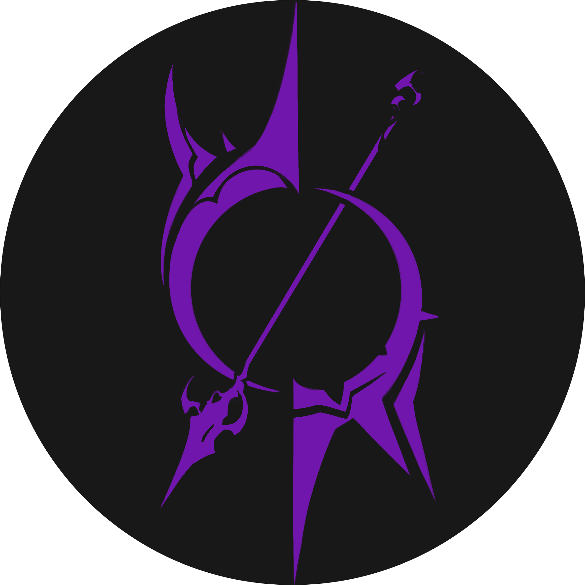

# GsW Website

<div align="center">
  
  <p>Hub digital oficial da comunidade GsW.</p>
  <a href="https://gsw-website.vercel.app/"><strong>Acessar Plataforma</strong></a>
</div>

<br />

<div align="center">
  
  
  
  
  
  
</div>

---

## Descrição do Projeto

Esta plataforma foi desenvolvida para estabelecer a presença digital da comunidade GsW. O sistema utiliza Next.js e Supabase para gerenciar uma interface de alta fidelidade e um painel administrativo dinâmico. A arquitetura foca em escalabilidade, performance e gestão de conteúdo em tempo real.

## Especificações Técnicas

* **Framework:** Next.js (App Router) com renderização híbrida.
* **Linguagem:** TypeScript para tipagem estática e integridade de dados.
* **Estilização:** Tailwind CSS para interfaces responsivas e otimizadas.
* **Infraestrutura:** Deploy automatizado via Vercel.
* **Banco de Dados & Auth:** Supabase (PostgreSQL, Storage e Authentication).

## Painel Administrativo e Controle de Acesso

O acesso ao painel administrativo em `/admin` é restrito a usuários autorizados. A gestão de acesso é realizada através do **Supabase Auth**, onde o administrador deve possuir uma conta previamente cadastrada no console do projeto para autenticação via e-mail e senha.

## Arquitetura de Dados (Setup Supabase)

A infraestrutura de backend deve seguir rigorosamente as definições abaixo para garantir a compatibilidade com o código-fonte:

### 1. Tabelas do Banco de Dados

* **Tabela `members`**
    * `id`: uuid (Primary Key).
    * `name`: text - Nome do integrante.
    * `role`: text - Cargo ou função desempenhada.
    * `order`: integer - Prioridade de exibição na interface.

* **Tabela `gallery`**
    * `id`: uuid (Primary Key).
    * `title`: text - Título descritivo da mídia.
    * `description`: text - Detalhes do registro.
    * `src`: text - URL da imagem em alta resolução.
    * `thumb_src`: text - URL da versão otimizada (thumbnail) para performance.

### 2. Armazenamento (Storage)

Foram implementados dois Buckets distintos no Supabase Storage:
* **`members`**: Destinado a fotos de perfil e ativos dos integrantes.
* **`gallery`**: Destinado ao acervo de mídia e registros de operações.

Ambos os buckets devem possuir as seguintes **Políticas de Acesso (RLS Policies)**, configuradas para serem aplicadas exclusivamente ao Target Role **`authenticated`**:
1. **SELECT**: Restrito a usuários autenticados.
2. **INSERT**: Restrito a usuários autenticados.
3. **UPDATE / DELETE**: Restrito a usuários autenticados.

### 3. Variáveis de Ambiente

Configuração necessária no arquivo `.env.local`:
```env
NEXT_PUBLIC_SUPABASE_URL=sua_url_do_supabase
NEXT_PUBLIC_SUPABASE_ANON_KEY=sua_chave_publica_anonima
